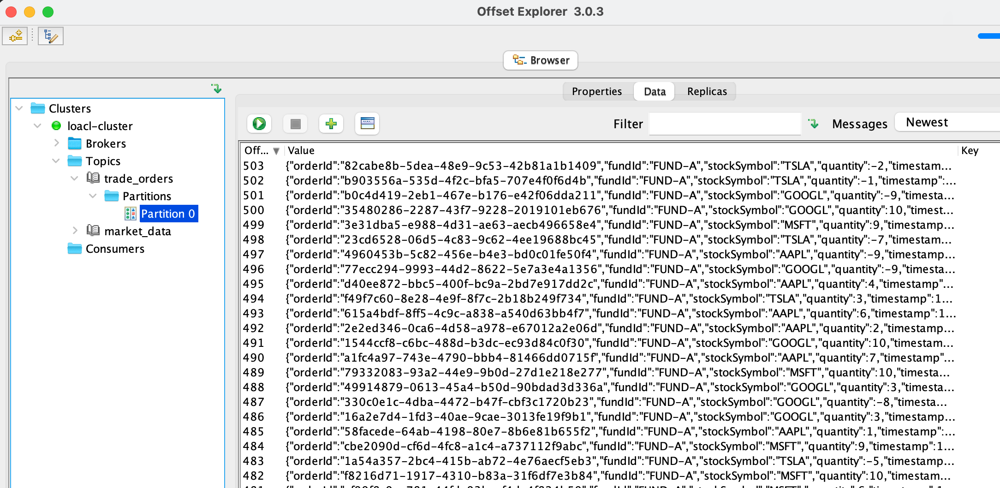
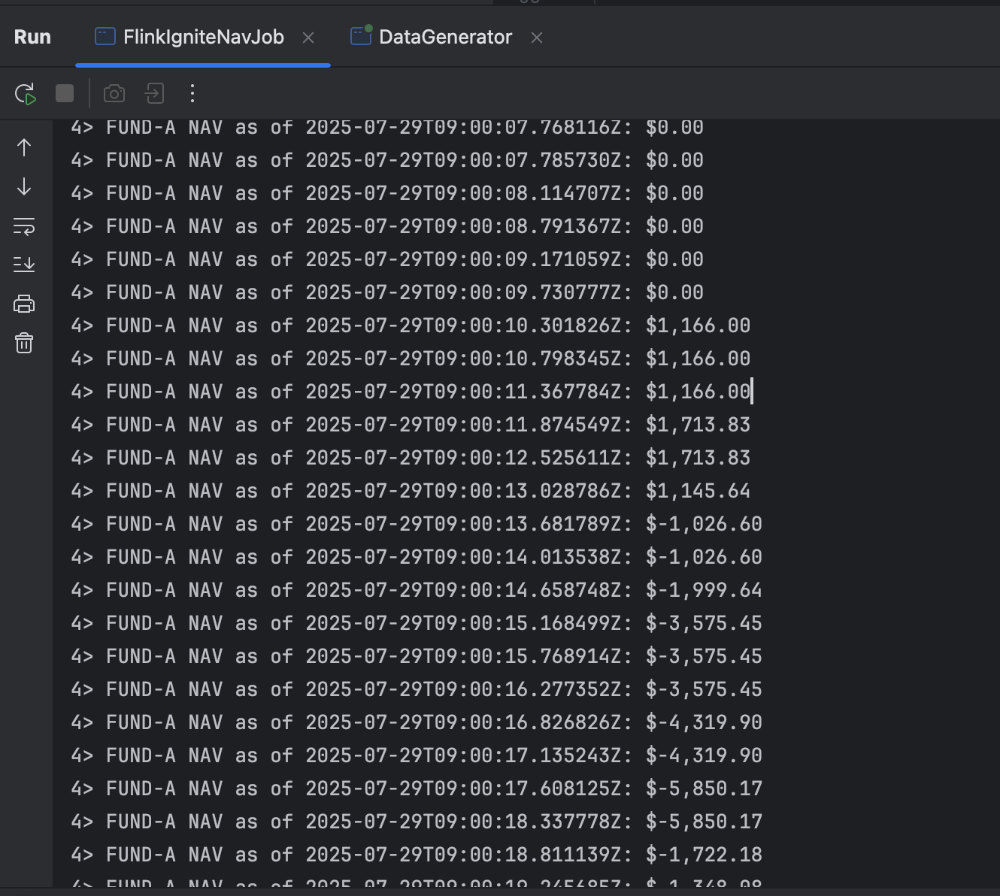
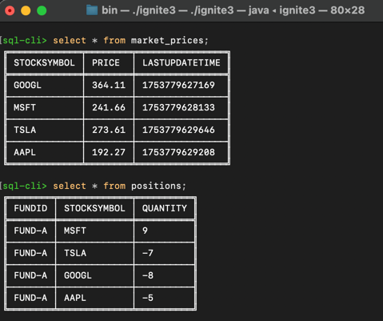

# NAV-FLINK-CALCULATOR

Flink2.0.0 demo to calculate-fund-nav with two data streams(including tradeOrder stream and marketData stream).

DataSource with KafkaSteam, and positions record with Ignite3;

## quick-start

* run kafka && zk with docker
```bash
cd script
docker-compose -d
```

* run flink 
```bash
cd script
sh start-flink.sh
```

* run ignite

see ignite official website doc

* run data-generate
```bash
cd script
sh data-generate.sh
```


* run calc job
```bash
cd script
sh run-job.sh
```




